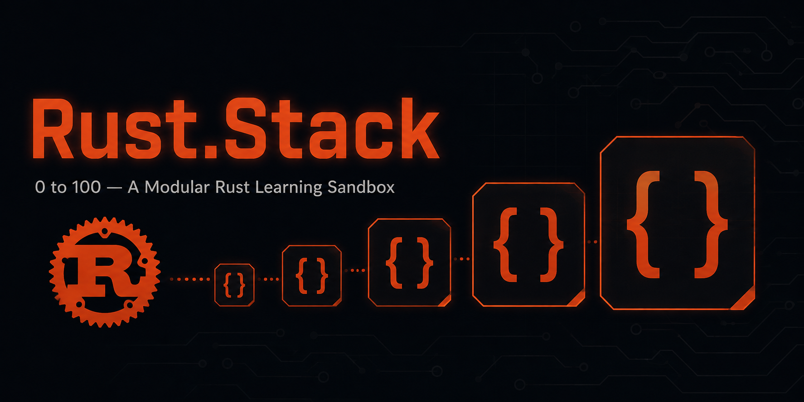

<p align="center">
  
</p>

<h1 align="center">🦀 Rust.Stack</h1>

<p align="center"><b>A self-contained, offline-friendly, 0-to-100 modular Rust learning sandbox.</b></p>

<p align="center">
  
  
  
  
  
  
</p>

<p>
  Rust.Stack takes you from <b>zero Rust knowledge</b> to <b>job-ready</b> across every major Rust
  specialization — backend, async/infra, systems/embedded, CLI/networking, WASM/frontend, game dev,
  blockchain — and finishes with interview and portfolio readiness.
</p>

<p>
  Built for programmers comfortable with general programming concepts in <i>some</i> language
  (Python, JS, Java, C++, etc.) but with zero Rust experience.
  No website. No toolchain wizard. No build step. <code>git clone</code> and go.
</p>

<br>

<a id="toc"></a>
## 📚 Table of Contents

- [✨ What Makes This Different](#what-makes-this-different)
- [🗺️ Curriculum at a Glance](#curriculum-at-a-glance)
- [🏆 Capstones](#capstones)
- [⚡ Quick Start](#quick-start)
- [📋 Prerequisites](#prerequisites)
- [📖 How to Use This Repo](#how-to-use-this-repo)
- [🗂️ Repository Structure](#repository-structure)
- [❓ FAQ](#faq)
- [✅ Progress Tracking](#progress-tracking)
- [📜 License & Contributing](#license--contributing)
- [🔁 CI](#ci)

---

<a id="what-makes-this-different"></a>
## ✨ What Makes This Different

| | |
|---|---|
| 🧵 **Strictly linear** | Module 000 → Module 100, in order. No branching, no choice paralysis. Every specialization gets a full 10-module block in sequence. |
| 🛠️ **100% hands-on** | Every module ships with a broken/incomplete Cargo crate. You fix it until `cargo test` passes. Every 10th module is a larger capstone project. |
| 👁️ **Solutions are visible** | Every module has a `solutions/` folder with the reference implementation, sitting alongside the exercise. No paywalls, no spoiler tags. |
| 🏗️ **Idiomatic & production-grade** | `?`, iterators, `thiserror`, `anyhow`, current-edition idioms throughout. `rustfmt` and `clippy` clean. |
| 📴 **Runs offline** | Once dependencies are cached, everything — READMEs, exercises, solutions — works without internet. |
| 🎯 **Interview-ready finish** | The final block covers DSA in Rust, system design, mock interviews, open source contribution, and portfolio building. Capstone 10 is a deliberate portfolio piece. |

<div align="right"><a href="#toc">⬆ back to top</a></div>

---

<a id="curriculum-at-a-glance"></a>
## 🗺️ Curriculum at a Glance

**92 modules + 10 capstones, organized into 10 blocks:**

| Block | Modules | Focus |
|---|---|---|
|  | 001–009 | Variables, ownership, borrowing, structs, enums, modules |
|  | 011–019 | Collections, error handling, generics, traits, lifetimes, testing |
|  | 021–029 | Closures, iterators, pattern matching, trait objects, smart pointers |
|  | 031–039 | Threads, `Mutex`/`Arc`, channels, unsafe Rust, macros, Cargo |
|  | 041–049 | Tokio runtime, async I/O, streams, pinning, structured concurrency |
|  | 051–059 | Memory layout, FFI, native debugging, profiling, benchmarking, SIMD, embedded |
|  | 061–069 | Axum, REST APIs, `sqlx`, JWT auth, middleware, Actix-web, Docker |
|  | 071–079 | `clap`, `ratatui`, TCP/UDP, gRPC, message queues, distributed systems |
|  | 081–089 | WebAssembly, Leptos, Bevy ECS, embedded revisited, smart contracts |
|  | 091–100 | DSA in Rust, system design, mock interviews, portfolio, open source |

Each block ends with a capstone project. Capstone 10 is a **full-stack Rust job-ready project** — the thing you point to in applications.

<div align="right"><a href="#toc">⬆ back to top</a></div>

---

<a id="capstones"></a>
## 🏆 Capstones

| # | Project | Key Tech |
|---|---|---|
|  | [Contact Book CLI](capstones/capstone-01-contact-book-cli/README.md) |    |
|  | [Inventory Management CLI](capstones/capstone-02-inventory-management-cli/README.md) |    |
|  | [In-Memory Graph Library](capstones/capstone-03-in-memory-graph-library/README.md) |    |
|  | [Multithreaded Log Processor](capstones/capstone-04-multithreaded-log-processor/README.md) |    |
|  | [Concurrent Rate-Limited Web Crawler](capstones/capstone-05-concurrent-web-crawler/README.md) |    |
|  | [Benchmarked Data Processing Library](capstones/capstone-06-benchmarked-data-processing-library/README.md) |    |
|  | [Task Management API](capstones/capstone-07-task-management-api/README.md) |     |
|  | [Distributed Key-Value Store](capstones/capstone-08-distributed-key-value-store/README.md) |    |
|  | [2D Game Compiled to WebAssembly](capstones/capstone-09-2d-game-in-webassembly/README.md) |   |
|  | [Full-Stack Rust Job-Ready Project](capstones/capstone-10-full-stack-job-ready-project/README.md) |    |

<div align="right"><a href="#toc">⬆ back to top</a></div>

---

<a id="quick-start"></a>
## ⚡ Quick Start

```bash
# 1. Install Rust (if you haven't already)
curl --proto '=https' --tlsv1.2 -sSf https://sh.rustup.rs | sh

# 2. Clone and enter the repo
git clone https://github.com/Amogh-007-Rin/RUST.STACK.git
cd RUST.STACK

# 3. Build everything (optional — verifies your setup works)
cargo check --workspace

# 4. Start at Module 000
cat modules/module-000-orientation/README.md
```

> [!TIP]
> **Estimated completion time:** 3–6 months at ~10 hours/week, assuming you work through every module and capstone.

<div align="right"><a href="#toc">⬆ back to top</a></div>

---

<a id="prerequisites"></a>
## 📋 Prerequisites

- 🦀 **Rust via rustup** — stable toolchain, pinned by `rust-toolchain.toml`
- 🧩 **rust-analyzer** — recommended: VS Code with the rust-analyzer extension
- 🔧 **Git**
- 🧠 Familiarity with programming fundamentals in any language (variables, functions, loops, basic data structures)

> [!NOTE]
> Everything installs from the internet once; after that, all content, examples, and exercises are fully offline.

**📄 See [docs/SETUP.md](docs/SETUP.md)** for detailed setup instructions.

<div align="right"><a href="#toc">⬆ back to top</a></div>

---

<a id="how-to-use-this-repo"></a>
## 📖 How to Use This Repo

The curriculum is strictly linear: **Module 000 → Module 100**, with a capstone
project at the end of every 10-module block.

### 🧩 Module Workflow

```
modules/module-042-the-tokio-runtime/
├── README.md          ← Read this first. Teaches the concept from scratch.
├── exercises/         ← Broken/incomplete code. Your job: fix it.
│   ├── Cargo.toml
│   ├── src/lib.rs     ← Contains // TODO(module-042): ... comments
│   └── tests/         ← Tests define "done"
└── solutions/         ← Reference implementation. Peek when stuck.
    ├── Cargo.toml
    ├── src/lib.rs
    └── tests/         ← Identical tests, all passing
```

1. **📘 Read** the module's `README.md` — it explains the concept from scratch with prose and code examples.
2. **🔍 Open** the exercise crate in your editor. Find the `TODO(module-XXX)` comments.
3. **🛠️ Fix** the code until the tests pass:
   ```bash
   cargo test -p module-042-exercises   # should start RED, end GREEN
   ```
4. **👀 Peek** at `solutions/` if you get truly stuck. No shame — the reference is there on purpose.
5. **✅ Verify** your work:
   ```bash
   ./scripts/verify_module.sh 042       # runs fmt, clippy, and tests
   ```
6. **☑️ Check the box** in the [curriculum map](#progress-tracking) below and move on.

### 🏆 Capstone Workflow

Same pattern, just bigger. Each capstone lives in `capstones/capstone-NN-*/` with
`starter/` (your work) and `solution/` (reference). They span 4–8 hours each and
integrate everything from the preceding block.

### 🧪 Running Tests

| Command | What it does |
|---|---|
| `cargo test -p module-XXX-exercises` | Run tests for one module's exercise |
| `cargo test -p module-XXX-solutions` | Run tests for one module's solution |
| `cargo test` | Run tests for all solution crates |
| `./scripts/verify_module.sh 042` | fmt + clippy + test for one module |

**📚 Full walkthrough, module anatomy, and FAQ: [docs/HOW_TO_USE.md](docs/HOW_TO_USE.md).**

<div align="right"><a href="#toc">⬆ back to top</a></div>

---

<a id="repository-structure"></a>
## 🗂️ Repository Structure

```
Rust.Stack/
├── README.md
├── Cargo.toml                  # Workspace root (glob members)
├── rust-toolchain.toml         # Pinned stable toolchain
├── CONTRIBUTING.md
├── LICENSE                     # MIT
├── docs/
│   ├── SETUP.md
│   └── HOW_TO_USE.md
├── scripts/
│   ├── new_module.sh           # Scaffolds a new module
│   ├── verify_module.sh        # fmt + clippy + test for one module
│   └── check_progress.sh       # Reports completion %
├── modules/
│   ├── module-000-orientation/
│   ├── module-001-toolchain-and-first-program/
│   ├── ...
│   └── module-100-final-capstone-support/
└── capstones/
    ├── capstone-01-contact-book-cli/
    ├── ...
    └── capstone-10-full-stack-job-ready-project/
```

<div align="right"><a href="#toc">⬆ back to top</a></div>

---

<a id="faq"></a>
## ❓ FAQ

<details>
<summary><b>I already know some Rust. Can I skip ahead?</b></summary>
<br>

Yes. Each module's README lists prerequisites. If you're comfortable with a
topic, skim the README, run the solution tests to confirm, and move on. The
capstones are especially useful for validation even if you skip blocks.

</details>

<details>
<summary><b>Do I need to be online?</b></summary>
<br>

No. Clone the repo once, run `cargo fetch` to cache dependencies, and you're
fully offline from that point forward.

</details>

<details>
<summary><b>Can I contribute?</b></summary>
<br>

Absolutely. See [CONTRIBUTING.md](CONTRIBUTING.md) for the folder shape
requirements, content guidelines, and the acceptance bar (fmt, clippy, tests
must be clean). PRs welcome for new modules, improvements to existing ones, or
bug fixes.

</details>

<details>
<summary><b>What if a module's solution tests don't pass for me?</b></summary>
<br>

Make sure you're on the stable toolchain (`rustup show`). The repo pins its
toolchain in `rust-toolchain.toml`. If you're on a different Rust version, some
dependencies may not compile. File an issue if the problem persists.

</details>

<details>
<summary><b>Is there a completion certificate or credential?</b></summary>
<br>

No. This is a plain git repo, not a platform. The portfolio project (Capstone
10) and the capstones you've built serve as your credential.

</details>

<details>
<summary><b>How long does it take?</b></summary>
<br>

Roughly 3–6 months at ~10 hours/week. Each module takes 45–90 minutes; each
capstone takes 4–8 hours. The curriculum has 101 slots (92 modules + 10
capstones, counting Module 000 and Capstone 10).

</details>

<div align="right"><a href="#toc">⬆ back to top</a></div>

---

<a id="progress-tracking"></a>
## ✅ Progress Tracking

Tick the checkboxes below as you complete modules and capstones. Run
`./scripts/check_progress.sh` to see your completion percentage.

- [ ] [Module 000 — Orientation](modules/module-000-orientation/README.md)

<details open>
<summary>🟥 <b>Block A — Foundations I</b> <code>001–009</code> → Capstone 01</summary>
<br>

- [ ] [Module 001 — Toolchain & Your First Program](modules/module-001-toolchain-and-first-program/README.md)
- [ ] [Module 002 — Variables, Mutability & Data Types](modules/module-002-variables-mutability-and-data-types/README.md)
- [ ] [Module 003 — Functions & Control Flow](modules/module-003-functions-and-control-flow/README.md)
- [ ] [Module 004 — Ownership Part 1](modules/module-004-ownership-part-1/README.md)
- [ ] [Module 005 — Ownership Part 2: Borrowing & References](modules/module-005-ownership-part-2-borrowing-and-references/README.md)
- [ ] [Module 006 — Slices & Strings](modules/module-006-slices-and-strings/README.md)
- [ ] [Module 007 — Structs](modules/module-007-structs/README.md)
- [ ] [Module 008 — Enums & Pattern Matching](modules/module-008-enums-and-pattern-matching/README.md)
- [ ] [Module 009 — Modules, Crates & Packages](modules/module-009-modules-crates-and-packages/README.md)
- [ ] [Capstone 01 — Contact Book CLI](capstones/capstone-01-contact-book-cli/README.md)

</details>

<details>
<summary>🟧 <b>Block B — Foundations II</b> <code>011–019</code> → Capstone 02</summary>
<br>

- [ ] [Module 011 — Common Collections I: `Vec<T>`](modules/module-011-common-collections-1-vec/README.md)
- [ ] [Module 012 — Common Collections II: `HashMap` & `HashSet`](modules/module-012-common-collections-2-hashmap-hashset/README.md)
- [ ] [Module 013 — Error Handling I: `panic!` & `Result`](modules/module-013-error-handling-1-panic-and-result/README.md)
- [ ] [Module 014 — Error Handling II: `?`, Custom Errors & `thiserror`](modules/module-014-error-handling-2-the-question-operator-and-thiserror/README.md)
- [ ] [Module 015 — Generics](modules/module-015-generics/README.md)
- [ ] [Module 016 — Traits I: Defining & Implementing](modules/module-016-traits-1-defining-and-implementing/README.md)
- [ ] [Module 017 — Traits II: Bounds & Trait Objects](modules/module-017-traits-2-bounds-and-trait-objects/README.md)
- [ ] [Module 018 — Lifetimes](modules/module-018-lifetimes/README.md)
- [ ] [Module 019 — Testing in Rust](modules/module-019-testing-in-rust/README.md)
- [ ] [Capstone 02 — Inventory Management CLI](capstones/capstone-02-inventory-management-cli/README.md)

</details>

<details>
<summary>🟨 <b>Block C — Intermediate Rust I</b> <code>021–029</code> → Capstone 03</summary>
<br>

- [ ] [Module 021 — Closures](modules/module-021-closures/README.md)
- [ ] [Module 022 — Iterators I: The `Iterator` Trait](modules/module-022-iterators-1-the-iterator-trait/README.md)
- [ ] [Module 023 — Iterators II: Combinators](modules/module-023-iterators-2-combinators/README.md)
- [ ] [Module 024 — Advanced Pattern Matching](modules/module-024-advanced-pattern-matching/README.md)
- [ ] [Module 025 — Advanced Traits](modules/module-025-advanced-traits/README.md)
- [ ] [Module 026 — Trait Objects & Dynamic Dispatch](modules/module-026-trait-objects-and-dynamic-dispatch/README.md)
- [ ] [Module 027 — Design Patterns in Rust](modules/module-027-design-patterns-in-rust/README.md)
- [ ] [Module 028 — Smart Pointers I: `Box`, `Deref`, `Drop`](modules/module-028-smart-pointers-1-box-deref-drop/README.md)
- [ ] [Module 029 — Smart Pointers II: `Rc` & `RefCell`](modules/module-029-smart-pointers-2-rc-refcell/README.md)
- [ ] [Capstone 03 — In-Memory Graph Library](capstones/capstone-03-in-memory-graph-library/README.md)

</details>

<details>
<summary>🟩 <b>Block D — Concurrency, Unsafe & Macros</b> <code>031–039</code> → Capstone 04</summary>
<br>

- [ ] [Module 031 — Concurrency I: Threads](modules/module-031-concurrency-1-threads/README.md)
- [ ] [Module 032 — Concurrency II: `Mutex` & `Arc`](modules/module-032-concurrency-2-mutex-arc/README.md)
- [ ] [Module 033 — Concurrency III: Channels](modules/module-033-concurrency-3-channels/README.md)
- [ ] [Module 034 — Concurrency IV: `Send`/`Sync` & Atomics](modules/module-034-concurrency-4-send-sync-atomics/README.md)
- [ ] [Module 035 — Unsafe Rust I](modules/module-035-unsafe-rust-1/README.md)
- [ ] [Module 036 — Unsafe Rust II](modules/module-036-unsafe-rust-2/README.md)
- [ ] [Module 037 — Macros I: Declarative](modules/module-037-macros-1-declarative/README.md)
- [ ] [Module 038 — Macros II: Procedural](modules/module-038-macros-2-procedural/README.md)
- [ ] [Module 039 — Cargo Deep Dive](modules/module-039-cargo-deep-dive/README.md)
- [ ] [Capstone 04 — Multithreaded Log Processor](capstones/capstone-04-multithreaded-log-processor/README.md)

</details>

<details>
<summary>🟦 <b>Block E — Async Rust</b> <code>041–049</code> → Capstone 05</summary>
<br>

- [ ] [Module 041 — Async Fundamentals](modules/module-041-async-fundamentals/README.md)
- [ ] [Module 042 — The Tokio Runtime](modules/module-042-the-tokio-runtime/README.md)
- [ ] [Module 043 — Async I/O](modules/module-043-async-io/README.md)
- [ ] [Module 044 — Async Synchronization](modules/module-044-async-synchronization/README.md)
- [ ] [Module 045 — Streams](modules/module-045-streams/README.md)
- [ ] [Module 046 — Pinning & Async Internals](modules/module-046-pinning-and-async-internals/README.md)
- [ ] [Module 047 — Structured Concurrency & Cancellation](modules/module-047-structured-concurrency-and-cancellation/README.md)
- [ ] [Module 048 — Error Handling in Async Code](modules/module-048-error-handling-in-async-code/README.md)
- [ ] [Module 049 — Async Patterns & Pitfalls](modules/module-049-async-patterns-and-pitfalls/README.md)
- [ ] [Capstone 05 — Concurrent Rate-Limited Web Crawler](capstones/capstone-05-concurrent-web-crawler/README.md)

</details>

<details>
<summary>🟪 <b>Block F — Systems Programming & Performance</b> <code>051–059</code> → Capstone 06</summary>
<br>

- [ ] [Module 051 — Memory Layout Deep Dive](modules/module-051-memory-layout-deep-dive/README.md)
- [ ] [Module 052 — FFI I: Calling C from Rust](modules/module-052-ffi-1-calling-c-from-rust/README.md)
- [ ] [Module 053 — FFI II: Calling Rust from C](modules/module-053-ffi-2-calling-rust-from-c/README.md)
- [ ] [Module 054 — Native Debugging & Performance Profiling](modules/module-054-performance-profiling/README.md)
- [ ] [Module 055 — Benchmarking with Criterion](modules/module-055-benchmarking-with-criterion/README.md)
- [ ] [Module 056 — Zero-Cost Abstractions & Optimization](modules/module-056-zero-cost-abstractions-and-optimization/README.md)
- [ ] [Module 057 — SIMD & Low-Level Optimization](modules/module-057-simd-and-low-level-optimization/README.md)
- [ ] [Module 058 — Introduction to Embedded Rust](modules/module-058-introduction-to-embedded-rust/README.md)
- [ ] [Module 059 — Embedded Rust Hands-On](modules/module-059-embedded-rust-hands-on/README.md)
- [ ] [Capstone 06 — Benchmarked Data Processing Library](capstones/capstone-06-benchmarked-data-processing-library/README.md)

</details>

<details>
<summary>🟫 <b>Block G — Backend Web Development</b> <code>061–069</code> → Capstone 07</summary>
<br>

- [ ] [Module 061 — HTTP & Web Fundamentals in Rust](modules/module-061-http-and-web-fundamentals/README.md)
- [ ] [Module 062 — Axum Fundamentals](modules/module-062-axum-fundamentals/README.md)
- [ ] [Module 063 — Building REST APIs with Axum](modules/module-063-building-rest-apis-with-axum/README.md)
- [ ] [Module 064 — Database Integration with `sqlx`](modules/module-064-database-integration-with-sqlx/README.md)
- [ ] [Module 065 — Authentication & Authorization](modules/module-065-authentication-and-authorization/README.md)
- [ ] [Module 066 — Middleware & the Tower Ecosystem](modules/module-066-middleware-and-the-tower-ecosystem/README.md)
- [ ] [Module 067 — Actix-web](modules/module-067-actix-web/README.md)
- [ ] [Module 068 — Testing Web Services](modules/module-068-testing-web-services/README.md)
- [ ] [Module 069 — Deployment & Observability](modules/module-069-deployment-and-observability/README.md)
- [ ] [Capstone 07 — Task Management API](capstones/capstone-07-task-management-api/README.md)

</details>

<details>
<summary>⬛ <b>Block H — CLI, Networking & Distributed Systems</b> <code>071–079</code> → Capstone 08</summary>
<br>

- [ ] [Module 071 — Building CLI Tools I: `clap`](modules/module-071-building-cli-tools-1-clap/README.md)
- [ ] [Module 072 — Building CLI Tools II: Config, Errors & Polish](modules/module-072-building-cli-tools-2-config-errors-and-polish/README.md)
- [ ] [Module 073 — Terminal UIs with `ratatui`](modules/module-073-terminal-uis-with-ratatui/README.md)
- [ ] [Module 074 — Raw Networking](modules/module-074-raw-networking/README.md)
- [ ] [Module 075 — Serialization Deep Dive](modules/module-075-serialization-deep-dive/README.md)
- [ ] [Module 076 — gRPC with Tonic](modules/module-076-grpc-with-tonic/README.md)
- [ ] [Module 077 — Distributed Systems Concepts I](modules/module-077-distributed-systems-1-concepts/README.md)
- [ ] [Module 078 — Distributed Systems II: Key-Value Store](modules/module-078-distributed-systems-2-key-value-store/README.md)
- [ ] [Module 079 — Message Queues & Event-Driven Systems](modules/module-079-message-queues-and-event-driven/README.md)
- [ ] [Capstone 08 — Distributed Key-Value Store](capstones/capstone-08-distributed-key-value-store/README.md)

</details>

<details>
<summary>🟣 <b>Block I — WASM, Frontend, Game Dev, Embedded & Blockchain</b> <code>081–089</code> → Capstone 09</summary>
<br>

- [ ] [Module 081 — Introduction to WebAssembly](modules/module-081-introduction-to-webassembly/README.md)
- [ ] [Module 082 — `wasm-bindgen` & JS Interop](modules/module-082-wasm-bindgen-and-js-interop/README.md)
- [ ] [Module 083 — Rust Frontend with Leptos](modules/module-083-rust-frontend-with-leptos/README.md)
- [ ] [Module 084 — WASM Performance Use Cases](modules/module-084-wasm-performance-use-cases/README.md)
- [ ] [Module 085 — Game Development with Bevy](modules/module-085-game-development-with-bevy/README.md)
- [ ] [Module 086 — Bevy Deep Dive: 2D Game](modules/module-086-bevy-deep-dive-2d-game/README.md)
- [ ] [Module 087 — Embedded Rust Revisited](modules/module-087-embedded-rust-revisited/README.md)
- [ ] [Module 088 — Blockchain & Smart Contracts in Rust](modules/module-088-blockchain-and-smart-contracts/README.md)
- [ ] [Module 089 — Comparing Rust Career Specializations](modules/module-089-comparing-rust-career-specializations/README.md)
- [ ] [Capstone 09 — 2D Game Compiled to WebAssembly](capstones/capstone-09-2d-game-in-webassembly/README.md)

</details>

<details>
<summary>🔴 <b>Block J — Interview Prep, DSA & Career Readiness</b> <code>091–100</code> → Capstone 10</summary>
<br>

- [ ] [Module 091 — Data Structures in Rust I](modules/module-091-data-structures-in-rust-1/README.md)
- [ ] [Module 092 — Data Structures in Rust II](modules/module-092-data-structures-in-rust-2/README.md)
- [ ] [Module 093 — Algorithms in Rust](modules/module-093-algorithms-in-rust/README.md)
- [ ] [Module 094 — Rust-Specific Interview Questions](modules/module-094-rust-specific-interview-questions/README.md)
- [ ] [Module 095 — System Design with Rust](modules/module-095-system-design-with-rust/README.md)
- [ ] [Module 096 — Open Source Contribution](modules/module-096-open-source-contribution/README.md)
- [ ] [Module 097 — Building Your Portfolio](modules/module-097-building-your-portfolio/README.md)
- [ ] [Module 098 — Mock Interview & Code Review Practice](modules/module-098-mock-interview-and-code-review-practice/README.md)
- [ ] [Module 099 — Advanced Topics & Staying Current](modules/module-099-advanced-topics-and-staying-current/README.md)
- [ ] [Module 100 — Final Capstone Support](modules/module-100-final-capstone-support/README.md)
- [ ] [Capstone 10 — Full-Stack Rust Job-Ready Project](capstones/capstone-10-full-stack-job-ready-project/README.md)

</details>

<div align="right"><a href="#toc">⬆ back to top</a></div>

---

<a id="license--contributing"></a>
## 📜 License & Contributing

| | |
|---|---|
| 📄 **License** | [MIT](LICENSE) |
| 🤝 **Contributing** | See [CONTRIBUTING.md](CONTRIBUTING.md) — required folder shapes, content guidelines, and the acceptance bar (fmt, clippy, tests clean, always). |

<div align="right"><a href="#toc">⬆ back to top</a></div>

---


<p align="center">
  <sub>Built with 🦀, one module at a time. Star ⭐ this repo if it's helping you learn Rust.</sub>
</p>